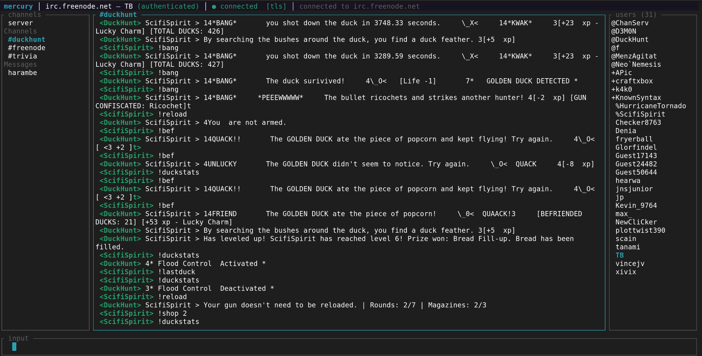

# Mercury



An IRCv3 chat client for POSIX terminals, written in Rust.

## Features

- Connect to and disconnect from an IRC server
- Create IRC channels (first JOIN creates the channel)
- Join and leave channels
- Full terminal UI with channel list, message pane, input bar, and status bar
- IRCv3-compliant protocol handling via the `irc` crate (automatic PING/PONG, registration)

## Stack

| Component      | Crate                          |
|----------------|--------------------------------|
| Language       | Rust (edition 2021)            |
| Async runtime  | `tokio` 1.x                    |
| IRC protocol   | `irc` 1.1                      |
| TUI            | `ratatui` 0.29 + `crossterm`   |
| Error handling | `thiserror` + `anyhow`         |
| Logging        | `tracing` + `tracing-subscriber` |

## Building

Requires Rust 1.70+ (stable).

```
cargo build
```

Release build:

```
cargo build --release
```

The binary is placed at `target/release/mercury`.

## Running

```
cargo run
```

### TUI commands

Once the TUI is open, type commands in the input bar:

| Command                      | Description                         |
|------------------------------|-------------------------------------|
| `/connect <host> [port]`     | Connect to an IRC server            |
| `/disconnect`                | Disconnect from the current server  |
| `/join <#channel>`           | Join a channel                      |
| `/create <#channel>`         | Create (and join) a new channel     |
| `/part <#channel> [reason]`  | Leave a channel                     |
| `/quit`                      | Quit Mercury                        |
| `/help`                      | Show available commands             |

Default port is `6667` if not specified.

## Testing

### Unit tests

No external dependencies required.

```
cargo test --test client_test --test channel_test
```

### Integration tests

Integration tests run against a live UnrealIRCd instance. Docker is required.

**Start the test IRC server:**

```
docker build -t mercury-ircd docker/unrealircd/
docker run -d --name mercury-ircd-test \
  -p 127.0.0.1:6667:6667 \
  -p 127.0.0.1:6697:6697 \
  mercury-ircd
```

**Run the integration tests:**

```
cargo test --features integration --test connect_integration --test channel_integration
```

The test harness connects to `127.0.0.1:6667`. If the port is already reachable it skips starting Docker, so you can also manage the container manually.

**Stop the test server:**

```
docker stop mercury-ircd-test && docker rm mercury-ircd-test
```

### All tests

```
# Unit
cargo test --test client_test --test channel_test

# Integration
cargo test --features integration --test connect_integration --test channel_integration
```

## Project layout

```
src/
  main.rs          # Binary entry point and TUI event loop
  lib.rs           # Library root (re-exports for testing)
  error.rs         # MercuryError enum
  irc/
    client.rs      # IrcClient, ClientConfig, ClientState
    channel.rs     # ChannelManager, ChannelState
    message.rs     # OutboundMessage and IRC wire serialization
  tui/
    app.rs         # Application state
    ui.rs          # ratatui layout and rendering
tests/
  unit/
    client_test.rs
    channel_test.rs
  integration/
    common.rs      # Docker test harness
    connect_test.rs
    channel_test.rs
docker/
  unrealircd/
    Dockerfile     # UnrealIRCd 6.1.8 built from source
    unrealircd.conf
  docker-compose.yml
```
